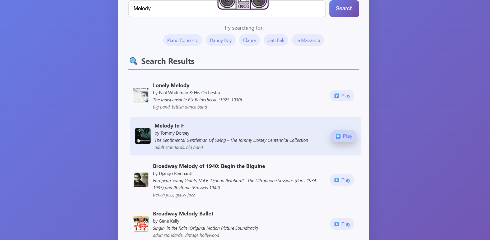

# Smart Music Recommendation System

## Overview

Intelligent music recommendation system using machine learning to suggest songs based on audio features. Built with content-based filtering using Spotify's dataset.

## What This Model Does

1. **Song Search**: Search 32,000+ songs by name
2. **Smart Recommendations**: Generate personalized suggestions using audio features
3. **Real-Time API**: Instant search and recommendations
4. **Modern UI**: Responsive interface with floating animations

## Screenshots

### Main Interface

*Dashboard with floating animation and search*

### Search & Recommendations

*Search results and personalized recommendations*

## Data Source

**Spotify Dataset:**
- 32,644+ songs with audio features
- Audio metrics: valence, danceability, energy, tempo, loudness, etc.
- Metadata: artists, albums, popularity, followers

## Machine Learning Model

- **Algorithm**: Nearest Neighbors + Cosine Similarity
- **Library**: scikit-learn
- **Features**: 15 audio and popularity metrics
- **Approach**: Content-based filtering

## Frontend Integration

- **Tech Stack**: HTML5, CSS3, JavaScript, Lottie animations
- **Features**: Responsive design, smooth animations, real-time search
- **API Integration**: RESTful endpoints for search and recommendations

## Quick Setup

1. Install dependencies: `pip install pandas numpy scikit-learn flask flask-cors joblib`
2. Place dataset files in `Data Set/` folder
3. Train model: `python train_model.py`
4. Run app: `python app.py`
5. Open `http://localhost:5000`

## API Endpoints

- `GET /search?q=<query>` - Search songs
- `POST /recommend` - Get recommendations for track_id
- `GET /` - Main interface

## Technologies

- **Backend**: Python, Flask, scikit-learn
- **Frontend**: HTML, CSS, JavaScript
- **ML**: NearestNeighbors, StandardScaler
- **Data**: Spotify audio features dataset
